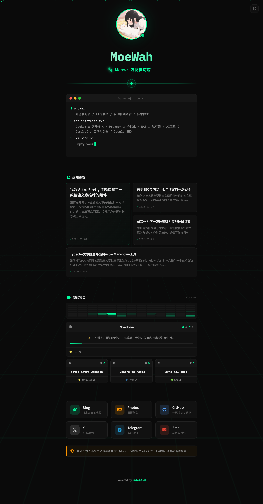

# MoeHome 个人主页

一个简约、酷炫的个人主页模板，支持静态 SEO 优化和配置化开发。


## 页面预览



## 特性

- 🎨 **配置驱动** - 所有内容在 config.js 中管理，无需修改代码
- 🔍 **SEO 友好** - 构建生成纯静态 HTML，搜索引擎完美支持
- ✨ **动态效果** - 粒子背景、发光分割线、自定义光标
- 📱 **响应式设计** - 完美适配移动端和桌面端
- 🚀 **零依赖** - 仅一个 Node.js 构建脚本，无需框架
- 📦 **易部署** - 构建输出即插即用，支持任意静态托管

## 快速开始

### 安装

```bash
git clone https://github.com/moewah/MoeHome.git
cd MoeHome
```

### 开发

```bash
# 修改 src/config.js 配置你的内容
# 构建生成静态页面
npm run build

# 本地预览
npm run serve
# 访问 http://localhost:8080
```

## 配置说明

所有配置都在 `src/config.js` 文件中：

### 基础信息

```javascript
profile: {
    name: 'MoeWah',
    tagline: {
        prefix: '🐾',
        text: 'Meow~',
        highlight: '万物皆可萌！'
    },
    avatar: 'images/avatar.webp'
}
```

### 社交链接

```javascript
links: [
    {
        name: 'Blog',
        description: '技术文章 & 教程',
        url: 'https://yourblog.com',
        icon: 'fa-solid fa-pen-nib',
        brand: 'blog',
        external: true,
        color: '#00ff9f',
        enabled: true  // 显示/隐藏按钮
    }
]
```

- `name` - 按钮显示名称
- `description` - 描述文字（移动端显示）
- `url` - 链接地址
- `icon` - Font Awesome 图标类
- `brand` - 品牌标识（用于 CSS 样式）
- `external` - 是否在新窗口打开
- `color` - 主题颜色（按钮颜色）
- `enabled` - 是否显示

### 终端内容

```javascript
identity: ['开源爱好者', 'Astro爱好者', 'AI探索者'],
interests: ['Astro & 前端开发', 'Docker & 容器技术'],

terminal: {
    title: '🐾 meow@tribe:~|',
    prompts: [
        { command: 'whoami', output: 'identity' },
        { command: 'cat interests.txt', output: 'interests' },
        { command: './wisdom.sh', output: 'dynamic' }
    ]
}
```

### 名人语录

```javascript
quotes: [
    "Empty your mind, be formless, shapeless, like water...",
    "Be water, my friend."
]
```

### 页脚

```javascript
footer: {
    text: 'Powered by',
    link: {
        text: 'Your Name',
        url: 'https://yourblog.com/'
    }
}
}
```

### 博客文章 RSS

从自定义 RSS 源获取最新文章，构建时预获取，零运行时延迟：

```javascript
rss: {
    enabled: true,                              // 启用/禁用
    url: 'https://yourblog.com/rss.xml',       // RSS 源地址
    count: 4,                                   // 显示文章数量
    openInNewTab: true,                         // 新标签页打开
    title: {
        text: '近期更新',                        // 区块标题
        icon: 'fa-solid fa-newspaper'          // 标题图标
    },
    display: {
        showDate: true,                         // 显示日期
        showDescription: true,                  // 显示摘要
        maxDescriptionLength: 100               // 摘要最大长度
    }
}
```

设置 `enabled: false` 可完全隐藏文章列表模块。

### GitHub 模块

项目展示和贡献图共用 GitHub 用户配置：

```javascript
// GitHub 用户配置
projects: {
    enabled: true,
    githubUser: 'https://github.com/yourusername',   // GitHub 用户主页
    count: 5,                                   // 显示项目数量（按 star 排序）
    exclude: ['.github'],                      // 排除的仓库名（支持正则）
}

// 贡献图配置
contribution: {
    enabled: true,           // 是否启用贡献图
    useRealData: true,       // true=真实数据, false=随机数据
    githubUser: '',          // 留空则自动使用 projects.githubUser
}
```

| 配置 | 说明 |
|------|------|
| `projects.githubUser` | GitHub 用户主页地址 |
| `projects.count` | 显示项目数量（按 star 降序） |
| `projects.exclude` | 排除的仓库名（支持正则匹配） |
| `contribution.useRealData` | `true`=API 获取真实数据，`false`=随机数据 |

**数据获取方式**：
- 项目列表：GitHub API `/users/{username}/repos`
- 贡献图：GitHub Events API `/users/{username}/events/public`

### 统计代码

支持多种统计工具配置，构建时注入到 HTML `<head>` 中：

```javascript
analytics: {
    // Google Analytics - enabled 启用开关，id 填写 Measurement ID
    googleAnalytics: {
        enabled: true,
        id: 'G-XXXXXXXXXX'
    },
    // Microsoft Clarity - enabled 启用开关，id 填写 Project ID
    microsoftClarity: {
        enabled: true,
        id: 'xxxxxxxxxxxx'
    },
    // Umami - 完整脚本标签，留空则不启用
    // 支持自定义参数如 data-host, data-domains 等
    umami: '<script defer src="https://umami.example.com/script.js" data-website-id="xxx"></script>',
    // 自定义脚本 - 数组形式，留空则不启用
    customScripts: [
        '<script>console.log("custom analytics")</script>'
    ]
}
```

| 配置项 | 禁用方式 |
|--------|---------|
| Google Analytics | `enabled: false` |
| Microsoft Clarity | `enabled: false` |
| Umami | `umami: ''` 留空 |
| customScripts | `customScripts: []` 空数组 |

## 项目结构

```
MoeHome/
├── src/
│   ├── app.js              # 页面交互逻辑
│   ├── config.js           # 配置文件
│   ├── style.css           # 样式文件
│   ├── theme-utils.js      # 主题工具函数
│   └── images/             # 图片资源
│       ├── avatar.webp     # 默认头像
│       ├── screenshot-full.png  # 预览截图
│       └── wechat.png      # 微信赞赏码
├── scripts/
│   ├── build.js            # 构建脚本
│   ├── contribution-fetcher.js  # GitHub 贡献数据获取
│   ├── github-fetcher.js   # GitHub 项目数据获取
│   └── rss-parser.js       # RSS 解析器
├── templates/
│   └── index.template.html # HTML 模板
├── dist/                   # 构建输出（部署用）
├── package.json
└── README.md
```

## 部署

构建后上传 `dist/` 目录到任意静态托管服务：

```bash
npm run build
# 上传 dist/ 目录
```

支持的平台：

- GitHub Pages
- Vercel
- Netlify
- Cloudflare Pages
- 阿里云 OSS
- 腾讯云 COS
- 自己的 Nginx 服务器

## 自定义样式

### 颜色变量

在 `src/style.css` 中修改 CSS 变量：

```css
:root {
    --bg-primary: #0a0a0a;      /* 背景色 */
    --bg-secondary: #111111;    /* 次级背景 */
    --text-primary: #e8e8e8;   /* 主文字 */
    --text-secondary: #888888;  /* 次级文字 */
    --accent: #00ff9f;          /* 主题色 */
    --border: #222222;          /* 边框色 */
}
```

### 添加新按钮

1. 在 `src/config.js` 的 `links` 数组中添加：

```javascript
{
    name: 'Telegram',
    description: '联系',
    url: 'https://t.me/yourname',
    icon: 'fa-brands fa-telegram',
    brand: 'telegram',
    external: true,
    color: '#229ED9',
    enabled: true
}
```

2. 运行 `npm run build`

## 技术栈

- HTML5 + CSS3 + Vanilla JavaScript
- Font Awesome 6 图标
- Google Fonts（Noto Sans SC + IBM Plex Mono）
- 零外部依赖

## 赞赏/捐赠

如果这个项目对你有帮助，欢迎请我喝杯咖啡：

### 微信支付


## 开源协议

MIT License - 随意修改和使用

---

如果喜欢这个项目，欢迎 Star ⭐️
