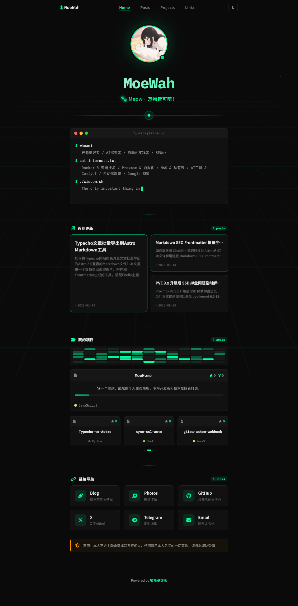
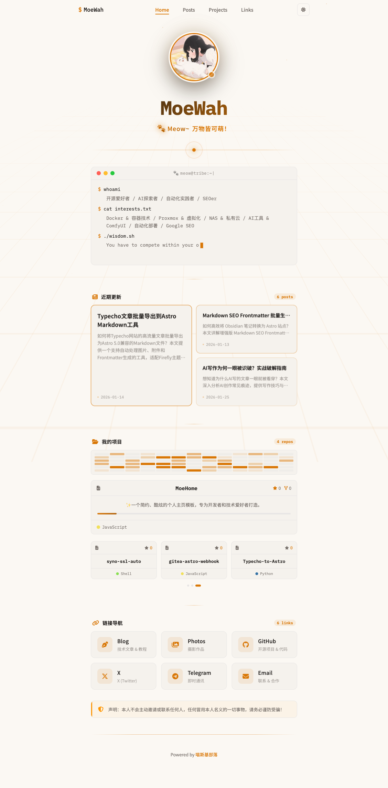
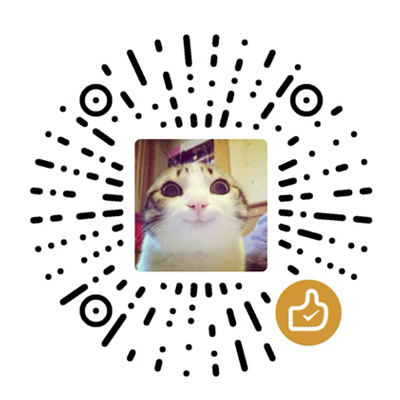

# MoeHome 个人主页

一个简约、酷炫的个人主页模板，配置驱动、静态优先，支持多主题配色、GitHub 集成、RSS 聚合，专注性能与视觉体验。


## 页面预览

**暗色主题**


**亮色主题**


## 特性

- 🎨 **配置驱动** - 所有内容在 config.js 中管理，无需修改代码
- 🔍 **SEO 友好** - 构建生成纯静态 HTML，搜索引擎完美支持
- 🔒 **邮箱反爬虫** - mailto 链接动态编码，防止被爬虫抓取邮箱地址
- ✨ **精致视觉** - 网格背景、玻璃光泽卡片、自定义光标、终端打字机
- 🎨 **多主题配色** - 跟随系统、浅色、暗色三种模式，八种精选配色方案，通过 config.js 锁定心仪色彩
- 📱 **响应式设计** - 完美适配移动端和桌面端，支持触摸手势
- 🚀 **零运行时依赖** - 前端无框架，构建时自动压缩优化
- 📦 **易部署** - 构建输出即插即用，支持任意静态托管
- 🐙 **GitHub 集成** - 自动展示项目和贡献图（支持真实/随机数据）
- 📰 **RSS 聚合** - 构建时预获取博客文章，无运行时延迟
- 🎵 **音乐播放器** - 支持 Meting API 和本地音乐，简约设计融入页面
- 📊 **多统计支持** - Google Analytics、Clarity、Umami、自定义脚本

## 快速开始

### 安装

```bash
git clone https://github.com/moewah/MoeHome.git
cd MoeHome
npm install  # 安装开发依赖
```

### 开发

```bash
# 修改 src/config.js 配置你的内容
# 构建生成静态页面
npm run build

# 本地预览
npm run serve
# 访问 http://localhost:8080
```

## 配置说明

所有配置都在 `src/config.js` 文件中，按页面渲染顺序：

### 主题配色

支持模式切换和配色方案切换，用户切换只在当前会话生效，刷新后恢复默认配置。

#### 模式切换

| 模式 | 说明 |
|------|------|
| `light` | 浅色模式 |
| `dark` | 深色模式 |
| `auto` | 跟随系统 |

#### 内置配色方案

| 方案 ID | 名称 | 类型 | 说明 |
|---------|------|------|------|
| `coralOrange` | 珊瑚橙 | 亮色 | 系统默认 |
| `nordSnowStorm` | 冰川青 | 亮色 | Nord 霜雪青色调 |
| `gruvboxLight` | 复古风 | 亮色 | 复古暖色调 |
| `ayuLight` | 简约风 | 亮色 | 简约清爽 |
| `cyberGreen` | 赛博绿 | 暗色 | 系统默认 |
| `catppuccinMocha` | 摩卡色 | 暗色 | 柔和粉彩 |
| `kanagawaDragon` | 浮世绘 | 暗色 | 浮世绘风格 |
| `rosePineMoon` | 鸢尾紫 | 暗色 | 优雅鸢尾紫 |

#### 配置示例

```javascript
theme: {
    // 默认模式: 'light' | 'dark' | 'auto'
    default: 'light',

    // 默认配色方案（刷新后恢复此配置）
    defaultScheme: {
        light: 'gruvboxLight',  // 亮色: null(使用内置默认coralOrange) | coralOrange | nordSnowStorm | gruvboxLight | ayuLight
        dark: 'catppuccinMocha' // 暗色: null(使用内置默认cyberGreen) | cyberGreen | catppuccinMocha | kanagawaDragon | rosePineMoon
    }
}
```

| 配置 | 说明 |
|------|------|
| `default` | 首屏默认模式 |
| `defaultScheme` | 默认配色方案，用户切换后刷新恢复此配置，设为 `null` 使用内置默认配色 |

**衍生色**：悬停、阴影、玻璃光泽等颜色自动计算，无需手动配置。

### 导航栏配置

支持顶部固定导航栏，包含品牌区、导航链接、主题切换和移动端菜单：

```javascript
nav: {
    enabled: true,

    // 品牌区配置
    brand: {
        showPrompt: true,       // 显示 $ 符号
        hoverText: '~/whoami',  // 自动循环打字机效果文字
    },

    // 自定义二级菜单（可选）
    menus: [
        {
            name: 'Resources',
            items: [
                { name: '工具推荐', url: 'https://example.com/tools', external: true },
                { name: '友情链接', url: 'https://example.com/links', external: true },
            ]
        }
    ],
}
```

| 配置 | 说明 |
|------|------|
| `brand.showPrompt` | 是否显示 `$` 符号 |
| `brand.hoverText` | 自动循环打字机效果显示的文字（与名字交替显示） |
| `menus` | 自定义二级菜单数组 |

**主题设置**：点击配色按钮展开菜单，选择模式（auto/light/dark）和配色方案。

**移动端手势**：支持从屏幕右边缘向左滑动打开侧边栏，侧边栏内向右滑动关闭。

### 基础信息

```javascript
profile: {
    name: 'MoeWah',
    tagline: {
        prefix: '🐾',
        text: 'Meow~',
        highlight: '万物皆可萌！'
    },
    avatar: 'images/avatar.webp'
}
```

### Favicon 配置

```javascript
favicon: {
    path: '',    // 自定义 favicon 路径（如 'images/favicon.ico'），留空则从头像自动生成
}
```

| 配置 | 说明 |
|------|------|
| `path` | 自定义 favicon 文件路径，留空则从头像自动生成 |

**自动生成尺寸**：16×16、32×32（ICO 文件）、180×180（Apple Touch Icon）

### 终端内容

```javascript
identity: ['开源爱好者', 'Astro爱好者', 'AI探索者'],
interests: ['Astro & 前端开发', 'Docker & 容器技术'],

terminal: {
    title: '🐾 meow@tribe:~|',
    prompts: [
        { command: 'whoami', output: 'identity' },
        { command: 'cat interests.txt', output: 'interests' },
        { command: './wisdom.sh', output: 'dynamic' }
    ]
}
```

### 名人语录

```javascript
quotes: [
    "Empty your mind, be formless, shapeless, like water...",
    "Be water, my friend."
]
```

### 音乐播放器

简约风格的音乐播放器，位于头像与终端之间：

```javascript
music: {
    enabled: true,              // 是否启用（禁用时显示分割线）
    volume: 0.5,                // 默认音量 (0-1)
    playMode: 'list',           // 播放模式: list=列表循环, one=单曲循环, random=随机
    mode: 'meting',             // 音乐来源: meting=在线API, local=本地文件

    // Meting API 模式
    meting: {
        server: 'netease',      // 平台: netease | tencent | kugou | xiami | baidu
        type: 'playlist',       // 类型: song | playlist | album | search | artist
        id: '10046455237',      // 歌单/单曲 ID
        apis: [                 // API 列表（按顺序尝试）
            'https://api.i-meto.com/meting/api?server=:server&type=:type&id=:id&r=:r',
            'https://api.injahow.cn/meting/?server=:server&type=:type&id=:id',
        ],
    },

    // 本地音乐模式（音乐文件放 src/music/ 目录）
    local: [
        'music/song1.mp3',
        'music/song2.mp3',
    ],
}
```

| 配置 | 说明 |
|------|------|
| `enabled` | 是否启用，禁用时显示原分割线 |
| `mode` | `meting`=在线音乐，`local`=本地文件 |
| `meting.server` | 音乐平台：`netease`/`tencent`/`kugou` 等 |
| `meting.id` | 歌单 ID，从平台分享链接中获取 |
| `local` | 本地音乐路径数组，相对于 `src/` 目录 |

### 博客文章 RSS

从自定义 RSS 源获取最新文章，构建时预获取：

```javascript
rss: {
    enabled: true,
    url: 'https://yourblog.com/rss.xml',
    count: 4,
    openInNewTab: true,
    title: {
        text: 'Recent Posts',
        icon: 'fa-solid fa-newspaper'
    },
    display: {
        showDate: true,
        showDescription: true,
        maxDescriptionLength: 100
    }
}
```

### GitHub 模块

项目展示和贡献图共用 GitHub 用户配置：

```javascript
projects: {
    enabled: true,
    githubUser: 'https://github.com/yourusername',
    count: 5,
    exclude: ['.github'],
}

contribution: {
    enabled: true,
    useRealData: true,      // true=真实数据, false=随机数据
    githubUser: '',         // 留空则自动使用 projects.githubUser
}
```

| 配置 | 说明 |
|------|------|
| `projects.githubUser` | GitHub 用户主页地址 |
| `projects.count` | 显示项目数量（按 star 降序） |
| `projects.exclude` | 排除的仓库名（支持正则匹配） |
| `contribution.useRealData` | `true`=API 获取真实数据，`false`=随机数据 |

### 链接模块配置

控制链接导航模块的整体开关和标题显示：

```javascript
linksConfig: {
    enabled: true,    // 改成 false 禁用整个链接导航模块
    title: {
        text: 'Quick Links',
        icon: 'fa-solid fa-link',
    },
},
```

### 社交链接

```javascript
links: [
    {
        name: 'Blog',
        description: '技术文章 & 教程',
        url: 'https://yourblog.com',
        icon: 'fa-solid fa-pen-nib',
        brand: 'blog',
        external: true,
        color: '#00ff9f',
        enabled: true
    },
    {
        name: 'Email',
        description: '联系 & 合作',
        url: 'mailto:admin@example.com',
        icon: 'fa-solid fa-envelope',
        brand: 'email',
        external: false,
        color: '#ea4335',
        antiCrawler: true,  // 邮箱反爬虫保护，对邮箱地址编码防止被抓取
        enabled: true
    }
]
```

| 配置 | 说明 |
|------|------|
| `name` | 按钮显示名称 |
| `url` | 链接地址 |
| `icon` | Font Awesome 图标类 |
| `color` | 按钮主题颜色 |
| `enabled` | 是否显示 |
| `antiCrawler` | 邮箱反爬虫保护（仅 mailto 链接有效），开启后邮箱地址会被编码 |

**邮箱反爬虫原理**：开启后，`mailto:admin@example.com` 会被转换为 `onclick="location.href='mailto:'+atob('...')"` 的形式，爬虫无法通过正则匹配或 HTML 解析获取邮箱，但用户点击仍可正常唤起邮件客户端。

### 赞赏支持

支持二维码扫码和外链跳转两种支付方式：

```javascript
donation: {
    enabled: true,
    message: '如果我的内容对你有帮助，欢迎请我喝杯咖啡~',
    methods: [
        { name: '微信支付', key: 'wechat', icon: 'fa-brands fa-weixin', qrImage: 'images/wechat.png', enabled: true },
        { name: '支付宝', key: 'alipay', icon: 'fa-brands fa-alipay', qrImage: 'images/alipay.png', enabled: true },
        { name: '爱发电', key: 'afdian', icon: 'fa-solid fa-heart', url: 'https://afdian.com/a/yourname', enabled: true },
        { name: 'PayPal', key: 'paypal', icon: 'fa-brands fa-paypal', url: 'https://www.paypal.com/paypalme/yourname', enabled: false },
    ],
},
```

| 配置 | 说明 |
|------|------|
| `qrImage` | 二维码图片路径（扫码支付） |
| `url` | 外链支付地址（跳转支付） |

**图标颜色**：默认使用主题 `accent` 配色，悬停时背景变品牌色、图标变白色。

> **建议**：启用 2-3 个支付方式为宜，骨架屏加载时最多显示 3 个按钮占位。

### 滚动进度按钮

右下角固定按钮，集成滚动进度环和返回顶部功能：

```javascript
scrollProgress: {
    enabled: true,       // 是否启用
    showThreshold: 30,   // 显示阈值（px），滚动超过此距离即显示
    smoothScroll: true,  // 点击是否平滑滚动返回顶部
}
```

| 配置 | 说明 |
|------|------|
| `enabled` | 是否启用滚动进度按钮 |
| `showThreshold` | 显示阈值，滚动超过此距离后按钮出现 |
| `smoothScroll` | 点击时是否使用平滑滚动 |

### 页脚

```javascript
footer: {
    copyright: {
        year: '2018-2026',
        name: 'Your Name',
        url: 'https://yourblog.com/'
    },
    icp: {
        enabled: false,           // 是否显示备案号
        number: '京ICP备XXXXXXXX号'
    }
}
```

### 统计代码

支持多种统计工具配置，构建时注入到 HTML `<head>` 中：

```javascript
analytics: {
    // Google Analytics - enabled 启用开关，id 填写 Measurement ID
    googleAnalytics: {
        enabled: true,
        id: 'G-XXXXXXXXXX'
    },
    // Microsoft Clarity - enabled 启用开关，id 填写 Project ID
    microsoftClarity: {
        enabled: true,
        id: 'xxxxxxxxxxxx'
    },
    // Umami - 完整脚本标签，留空则不启用
    // 支持自定义参数如 data-host, data-domains 等
    umami: '<script defer src="https://umami.example.com/script.js" data-website-id="xxx"></script>',
    // 自定义脚本 - 数组形式，留空则不启用
    customScripts: [
        '<script>console.log("custom analytics")</script>'
    ]
}
```

| 配置项 | 禁用方式 |
|--------|---------|
| Google Analytics | `enabled: false` |
| Microsoft Clarity | `enabled: false` |
| Umami | `umami: ''` 留空 |
| customScripts | `customScripts: []` 空数组 |

## 项目结构

```
MoeHome/
├── src/
│   ├── app.js              # 页面交互逻辑
│   ├── config.js           # 配置文件
│   ├── style.css           # 样式文件
│   ├── theme-utils.js      # 主题工具函数
│   ├── music/              # 本地音乐文件（可选）
│   └── images/             # 图片资源
│       ├── avatar.webp     # 默认头像
│       ├── screenshot-full.png  # 预览截图
│       └── wechat.png      # 微信赞赏码
├── scripts/
│   ├── build.js            # 构建脚本
│   ├── contribution-fetcher.js  # GitHub 贡献数据获取
│   ├── github-fetcher.js   # GitHub 项目数据获取
│   └── rss-parser.js       # RSS 解析器
├── templates/
│   └── index.template.html # HTML 模板
├── dist/                   # 构建输出（部署用）
├── package.json
└── README.md
```

## 部署

构建后上传 `dist/` 目录到任意静态托管服务：

```bash
npm run build
# 上传 dist/ 目录
```

支持的平台：

- GitHub Pages
- Vercel
- Netlify
- Cloudflare Pages
- 阿里云 OSS
- 腾讯云 COS
- 自己的 Nginx 服务器

## 技术栈

### 运行时

- HTML5 + CSS3 + Vanilla JavaScript
- Font Awesome 6 图标
- Google Fonts（IBM Plex Mono 等宽字体）
- 中文字体使用系统回退（PingFang SC / Microsoft YaHei 等）

### 开发依赖（仅构建时）

| 依赖 | 用途 |
|------|------|
| terser | JavaScript 压缩 |
| lightningcss | CSS 压缩 |
| html-minifier-terser | HTML 压缩 |
| sharp | 图片压缩（WebP/PNG/JPEG） |

### 环境变量配置

构建时支持环境变量控制压缩行为：

```bash
# 启用/禁用压缩（默认启用）
MINIFY=true npm run build

# 单独控制各类资源
MINIFY_JS=true MINIFY_CSS=true MINIFY_HTML=true npm run build

# 图片压缩质量 (1-100)
IMAGE_QUALITY=80 npm run build

# 禁用图片压缩
COMPRESS_IMAGES=false npm run build
```

## 赞赏/捐赠

如果这个项目对你有帮助，欢迎请我喝杯咖啡：

### 微信支付



## 开源协议

MIT License - 随意修改和使用

---

如果喜欢这个项目，欢迎 Star ⭐️
